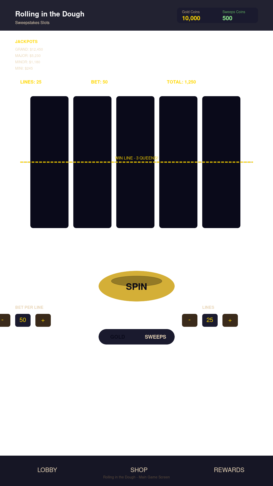

# Rolling in the Dough

A full-stack social casino slot machine — pirate-themed ("Pirates Gold"), with dual-currency play, a Hold & Win bonus, progressive jackpots, and Square/Coinbase payment processing.



## Features

- **Slot machine core** — 5-reel cabinet with 25 paylines, wilds, scatters, cascading wins, and near-miss mechanics; RTP tuned to ~93% (verified by 2M-spin simulation)
- **Dual currency** — Gold Coins (free play, generous daily bonuses) and Green Coins (sweepstakes, cash-out eligible)
- **Bonus games** — Vegas-style sticky coin Hold & Win, scratch cards, bonus wheel, coin flip
- **Progressive jackpots** — MINI / MINOR / MAJOR / GRAND tiers with 2% contribution
- **Retention systems** — daily streaks, achievements, onboarding tutorial, local practice leaderboard, local A/B testing framework
- **Payments** — Square Checkout API for coin purchases, Coinbase Commerce for crypto, cash-out system ($5 minimum, 100 coins = $1)
- **Audio** — Web Audio API sound design with per-tier win sounds, haptics on mobile
- **Security** — bcrypt auth, rate limiting, helmet CSP, payment verification, anti-cheat validation (see [SECURITY_AUDIT.md](SECURITY_AUDIT.md))

## Tech stack

| Layer | Tech |
|---|---|
| Client | React 19, Vite 7, Tailwind CSS 4, Radix UI, wouter, framer-motion |
| API | tRPC 11 over Express 4 |
| Database | PostgreSQL via Drizzle ORM |
| Payments | Square SDK, Coinbase Commerce |
| Testing | Vitest (120 tests) |
| Tooling | TypeScript 5.9, pnpm 10, Prettier |

## Getting started

**Prerequisites:** Node.js ≥ 20.19 (or ≥ 22.12), pnpm 10, a PostgreSQL database.

```bash
pnpm install
cp .env.example .env   # fill in DATABASE_URL, JWT_SECRET, etc.
pnpm db:push           # generate + run migrations
pnpm dev               # starts server + Vite on http://localhost:3000
```

See [.env.example](.env.example) for all configuration options (Square, Coinbase, OAuth).

## Scripts

| Command | Description |
|---|---|
| `pnpm dev` | Dev server with HMR |
| `pnpm build` | Production build (client + server bundle in `dist/`) |
| `pnpm start` | Run production build |
| `pnpm check` | Typecheck (`tsc --noEmit`) |
| `pnpm test` | Run the Vitest suite |
| `pnpm verify` | Typecheck + tests |
| `pnpm db:push` | Generate and apply Drizzle migrations |
| `pnpm format` | Prettier write |

## Project structure

```
client/          React app (Vite root)
  src/components/  Slot machine, overlays, modals, shop UI
  src/lib/         Game engine, audio, analytics, A/B, promotions
server/          Express + tRPC backend
  _core/           Server bootstrap, OAuth, security middleware, context
  routers/         tRPC routers (game, shop, cashout, achievements, ...)
shared/          Types shared between client and server
drizzle/         Generated migrations
docs/            Design and research notes
```

## Deployment

- **Docker** — see [Dockerfile](Dockerfile) and [docker-compose.yml](docker-compose.yml)
- **Render** — see [render.yaml](render.yaml); the server binds `0.0.0.0` and exposes `/health`

## Documentation

- [SECURITY_AUDIT.md](SECURITY_AUDIT.md) — security findings and remediation status
- [docs/IMPROVEMENT_GUIDE.md](docs/IMPROVEMENT_GUIDE.md) — improvement ideas and priorities
- [IMPLEMENTATION_PLAN.md](IMPLEMENTATION_PLAN.md) / [todo.md](todo.md) — delivery history and roadmap
- [PLAY_STORE_LISTING.md](PLAY_STORE_LISTING.md) — store copy and assets

## License

[MIT](LICENSE) © Daniel Collins
